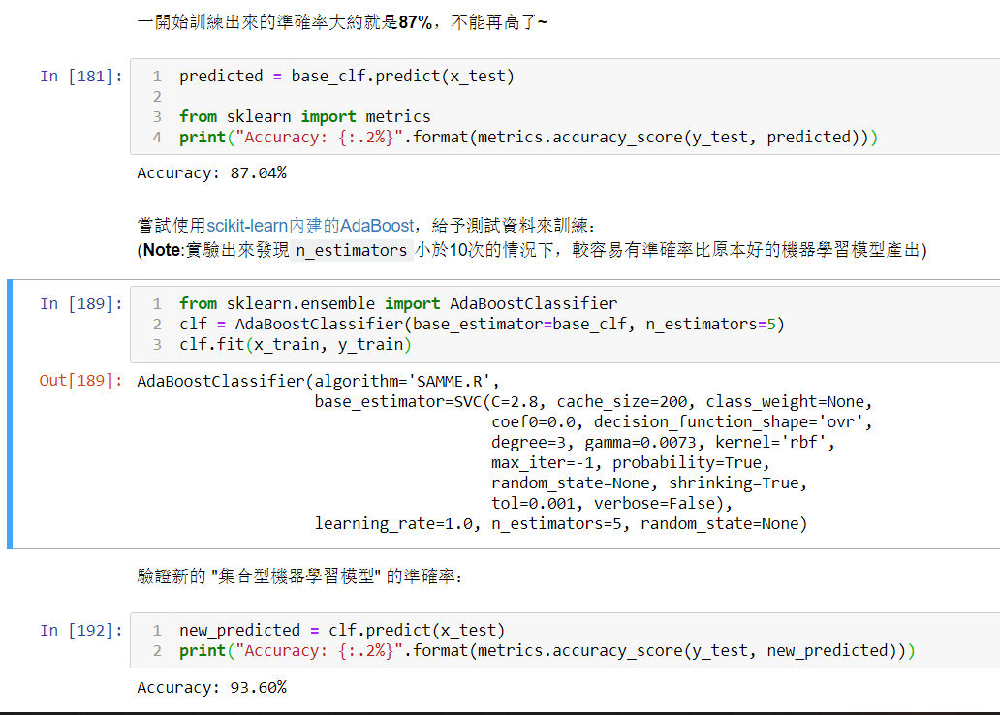

# **作業3** 練習使用Boosting演算法提升模型的效能

[Boosting演算法](https://www.analyticsvidhya.com/blog/2015/11/quick-introduction-boosting-algorithms-machine-learning/)可以藉由在機器學習模型在初步訓練完成，雖然準確度不高但至少有辦法標註出辨識結果之後，人為的方式強化其辨識效果以達到更進一步的微調提升。

其演算法原理，其實近似於人類補習班的學習模式：  
_對學員模擬考、檢討作答錯誤，並下次特別著重於該考題類型出題來施行連續模擬考以便提升考試分數_ 的方式。

>1. 先以原始訓練資料(假設有m個初始權重一致的樣本資料集)訓練出一個雖然準確率不高，但至少可以有基本判斷結果的機器學習模型。
>2. 對模型有辨識錯誤的樣本，增加權重，以產生出訓練下一輪模型用的資料集。
>3. 拿這個新權重的資料集來訓練下一個疊代的新機器學習模型。
>4. 重複1~3的步驟n次，所以總共有n個機器學習模型產出物。
>5. 最後在應用場景中使用來預測實際結果時，由這個n個模型中選擇多個辨識度高與低的模型聯合使用，以便產出真正的判斷輸出。

在這次作業要做的是：  
使用[scikit-learn提供的AdaBoostClassifier](https://scikit-learn.org/stable/modules/generated/sklearn.ensemble.AdaBoostClassifier.html#sklearn.ensemble.AdaBoostClassifier)，將[作業2-2](../20190731/work2.md)的SVM手寫數字辨識模型，(看能否)將準確率提高到 **90%** 以上。

([解答](https://notebooks.azure.com/windperson/projects/work3answer))

【提示】  

- 記得將[SVM設定成使用機率的](https://scikit-learn.org/stable/modules/generated/sklearn.svm.SVC.html)`probability=True`，才能在AdaBoostClassifer使用。
- 重複的次數不用太多，一來準確率會下降，二來實際用來做預測時的所需的運算時間會增加，原本這種boost演算法就不保證每次產出的結果模型，其提升的準確率是固定的。
- 以下是實驗成功的截圖：  
  
