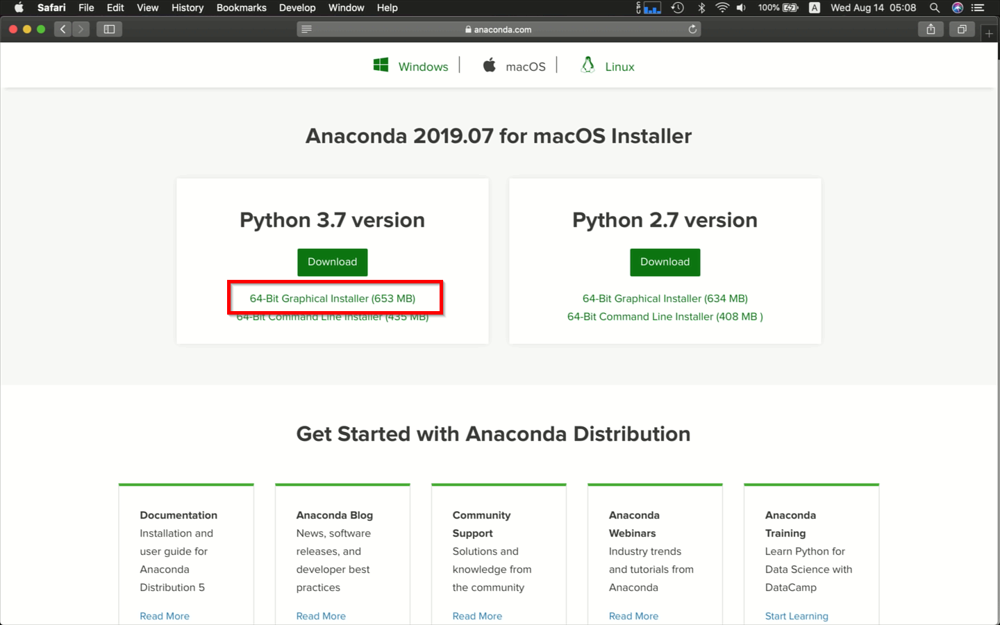
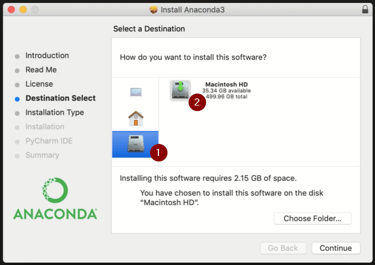

# Anaconda MacOS環境安裝步驟

## 下載

記得選MacOS x64位元版本安裝檔下載：  

## 安裝

* 執行安裝檔時，如果Mac的登入帳號是中文名稱，建議直接安裝在根目錄：  
   

## 執行時的注意事項

* 由於MacOS的捷徑無法設定啟動時的工作目錄位置，使用[終端機](https://support.apple.com/zh-tw/guide/terminal/welcome/mac)或是[iTerm2](https://iterm2.com/)在命令列視窗切換到沒有中文字或有空白字元的路徑的目錄，執行`juypter notebook`以便啟動Juypter Notebook。  
   可參考[Juypter Notebook官方說明](https://jupyter-notebook-beginner-guide.readthedocs.io/en/latest/execute.html#change-jupyter-notebook-startup-folder-mac-os)

* 結束Juypter Notebook時記得在命令列視窗按`Ctrl+C`以便結束其內建server。
