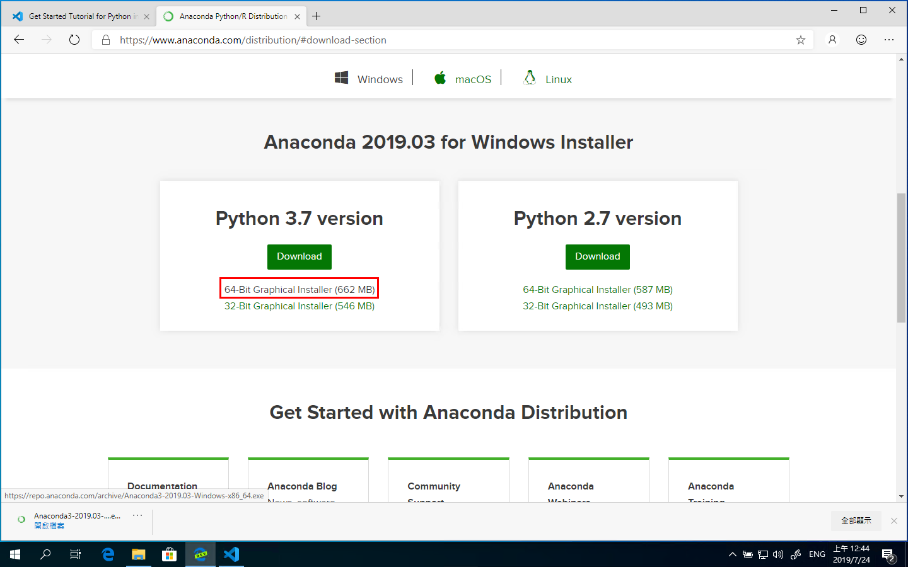
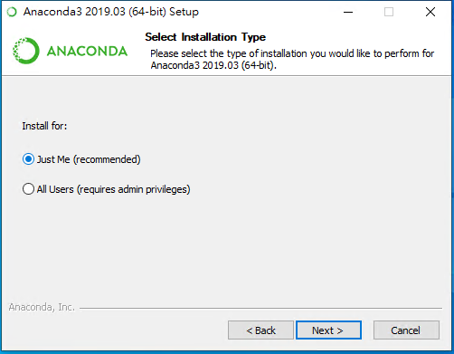
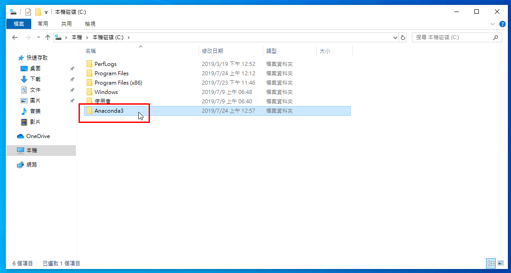
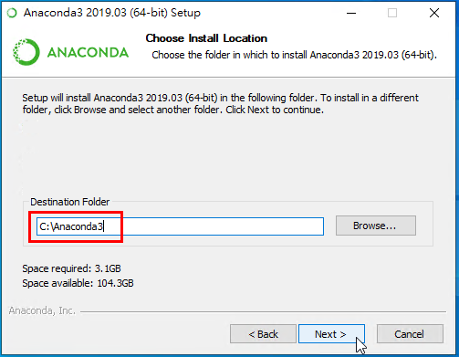
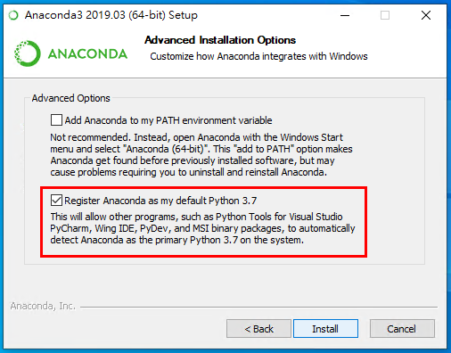
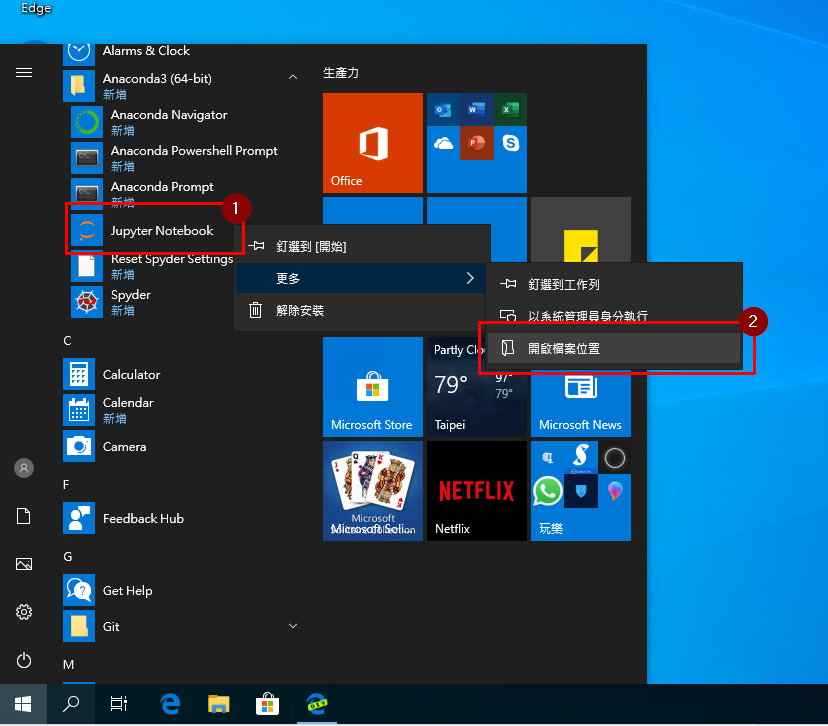
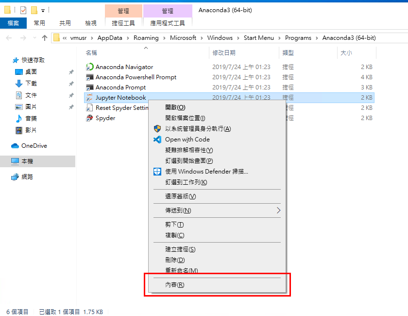
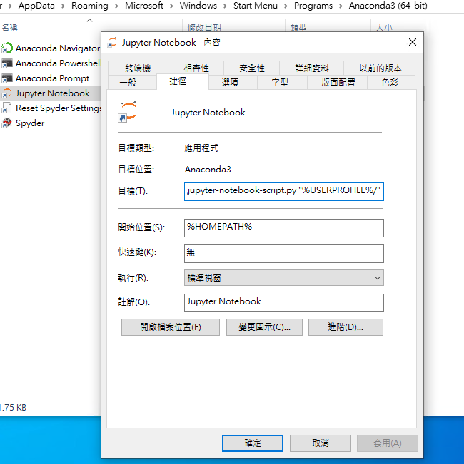
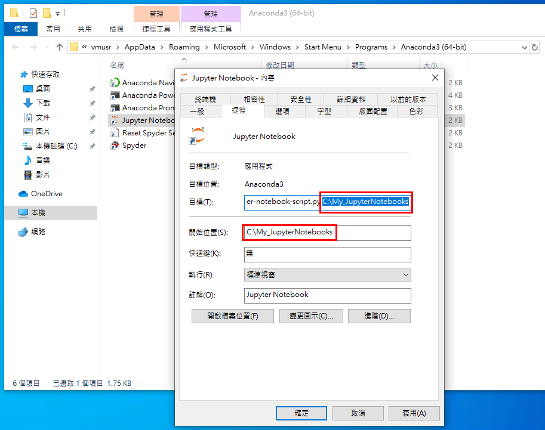
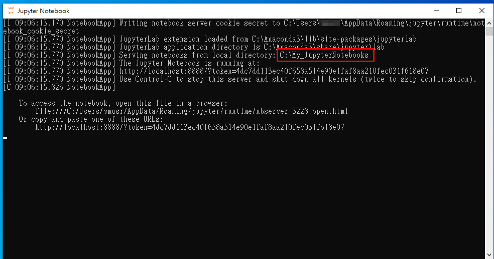

# Anaconda Windows環境安裝步驟

## 下載

記得選Windows x64位元版本安裝檔下載：  

## 安裝

1. 執行安裝檔時，第一個選項記得選擇JustMe：  
   

2. 由於預設的Anaconda會建立在目前登入的使用者目錄底下，而繁體中文版Windows的使用者目錄有時候會因為登入名稱是中文字或有空白字元的，會導致Python程式函式庫的載入路徑不正常；  
   先在根目錄建立一個叫`Anaconda3`空目錄：  
   

3. Anaconda安裝畫面按下一步到選擇安裝路徑時，選擇上一個步驟建立的目錄：  
   

4. 在接下來的安裝畫面選擇中，如果有如同下圖的，勾選 *Register Anaconda as my default Python 3.7*：  
   

## 安裝後的環境設置

由於Jupyter Notebook啟動時預設儲存Notebook檔案的目錄，會使用目前登入的使用者目錄，而繁體中文版Windows的使用者目錄有時候會因為登入名稱是中文字或有空白字元的，因此導致Juypter Notebook的載入路徑異常；  
所以需要對Juypter Notebook的啟動捷徑做設定：

1. Anaconda安裝完之後，對開始目錄的Jupyter Notebook項目按右鍵，選擇 **[更多]/[開啟檔案位置]**：  
   

2. 開啟的目錄中，選擇Jupyter Notebook的捷徑，按右鍵，選 **內容(R)**  
   

3. 開啟的內容視窗如下圖：  
   

4. 將 **目標(T)** 文字輸入框最後面的`"%USERPROFILE%/"`換成自己想要儲存Jupyter Notebook的目錄，在此畫面範例是 `C:\My_JuypterNotebooks`，  
   **開始位置(S)** 文字輸入框的位置也要置換掉：  
   

5. 按下方的 **套用(A)** 和 **確定** 關閉Jupyter Notebook捷徑的內容視窗之後，之後啟動Jupyter Notebook時，就會使用前一個步驟所設定的目錄位置：
   

可參考Juypter Notebook官方說明：[http://jupyter-notebook-beginner-guide.readthedocs.io/en/latest/execute.html](http://jupyter-notebook-beginner-guide.readthedocs.io/en/latest/execute.html)
